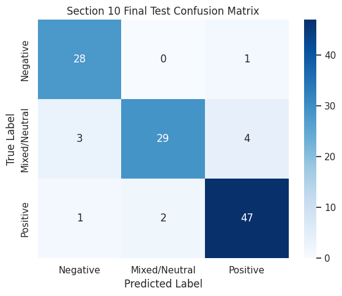
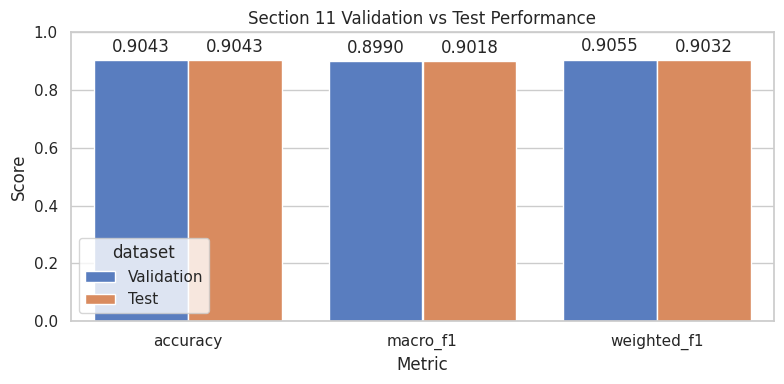

# Multilingual Pizza Review Sentiment Analysis with RNNs

[](https://www.linkedin.com/in/rudhresh-r/)
[](https://github.com/rudybrrr)

A three-class sentiment classifier for English and Malay pizza reviews using recurrent neural networks.



## Overview

The project frames score-derived review sentiment as Negative, Mixed/Neutral, or Positive after data-quality checks, duplicate handling, and exploratory analysis. It compares language strategies and recurrent model families, then evaluates a locked final model with class-, language-, confidence-, and review-level error analysis.

## Dataset

The dataset is **not included**. The supplied notebook expects `datasets/Pizza reviews.csv` with `Review`, `Score`, and `Language` columns. It retains English and Malay reviews, derives Negative for scores 0–3, Mixed/Neutral for scores above 3 through 7, and Positive for scores above 7. The supplied material does not identify a direct public source or redistribution terms, so the data has not been copied here.

Create a local `datasets/` directory and provide the CSV at the expected path. `DATA_PATH` in either notebook can be changed if the file is stored elsewhere.

## Approach

The selected Strategy B representation prefixes each review with a language token (`lang_english` or `lang_malay`). The tokenizer is fit only on training text. Controlled experiments compared SimpleRNN, LSTM, GRU, stacked LSTM, and LSTM+GRU architectures; the final choice was a Bidirectional SimpleRNN.

Final configuration: vocabulary size 1,000, embedding dimension 32, sequence length 15, 64 RNN units, recurrent dropout 0.2, post-RNN dropout 0.3, Adam at 0.001, and `ReduceLROnPlateau` with patience 3. L2 regularisation, LayerNorm, class weights, and sentence-fragment augmentation were tested but not selected.

## Results

| Test metric | Result |
| --- | ---: |
| Loss | 0.2672 |
| Accuracy | 0.9043 |
| Macro F1 | 0.9018 |
| Weighted F1 | 0.9032 |

Negative and Positive were the strongest test classes (F1 0.9180 and 0.9216); Mixed/Neutral was harder (F1 0.8657). The review-level analysis found difficulty with short, vague, and mixed-sentiment text.



## Repository structure

```text
notebooks/multilingual_pizza_sentiment.ipynb  # full experiment record
evaluation/evaluate_rnn_model.ipynb           # rebuild, reload, and evaluate final weights
models/final_rnn.weights.h5                   # selected final weights
assets/                                       # selected existing notebook figures
```

## Running the project

1. Install dependencies: `pip install -r requirements.txt`.
2. Provide `datasets/Pizza reviews.csv` as described above.
3. From the repository root, open `notebooks/multilingual_pizza_sentiment.ipynb`. The evaluation notebook reloads the included weights after the dataset is available.

Results reflect the documented run; retraining a small neural model can vary by environment.

## Limitations

This is a project-specific classifier for the supplied bilingual pizza-review data, not a general-purpose multilingual sentiment platform. Its small, score-derived dataset and the inherent ambiguity of Mixed/Neutral reviews limit broader conclusions.

## Coursework context

This project originated as coursework for a Deep Learning module at Singapore Polytechnic and has been cleaned and reorganised for public presentation.

Author: Agne Rudhresh
